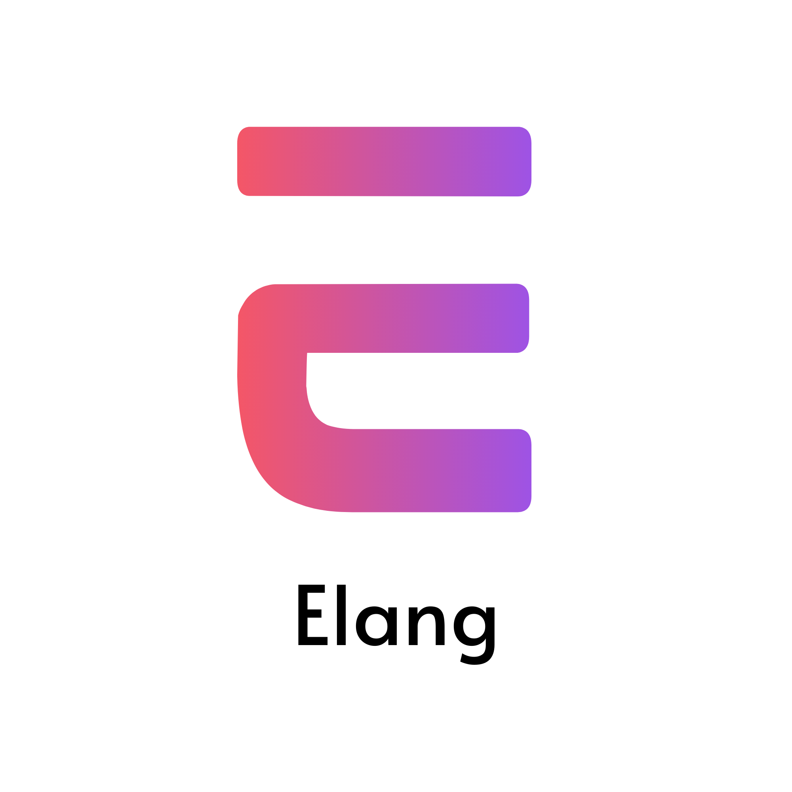

# Elang

<p align="center">
  
</p>

<p align="center">
  <strong>A lightweight, beginner-focused programming language.</strong>
</p>

<p align="center">
  
  
  
  
</p>

---

## Overview

**Elang** is a small interpreted programming language designed with clarity and approachability in mind. It features a clean syntax, first-class functions, built-in modules, and a standalone Windows runtime.

This is the initial public release (**v0.1.0**). It's a hobby project built to explore language design and provide a simple environment for learning logic.

---

## Installation (Windows)

1. Download the latest release from the **Releases** section.
2. Run `ElangSetup.exe`.
3. After installation, verify by running:
   ```bash
   elang hello.elang
   ```

**The installer can optionally:**
- ✅ Add Elang to your system **PATH**
- ✅ Associate **.elang** files (double-click to run)
- ✅ Install the **VS Code extension** automatically

---

## Quick Example

```eusha
say("Hello, World!").newl
```

---

## Language Features

### Variables
```eusha
name = "Eusha"
age = 16
active = true
```

### String Interpolation
```eusha
say("Hello {name}, you are {age} years old!").newl
say("2 + 3 = {2 + 3}").newl
```

### Functions
```eusha
fn greet(name) {
    say("Hello {name}!").newl
}
```

### Lambdas
```eusha
nums = [1, 2, 3, 4, 5]
evens = nums.filter(x => x % 2 == 0)
```

### Arrays
```eusha
nums = [3, 1, 4, 1, 5]
nums.sort()
say(nums.sum()).newl
```

### Objects
```eusha
person = {name: "Eusha", age: 16}
say(person.name).newl
```

### Control Flow
```eusha
if age >= 18 {
    say("Adult").newl
} else {
    say("Minor").newl
}

for (i in 1..5) {
    say(i).space
}

while x < 10 {
    x += 1
}
```

### Modules
```eusha
use math
say(math.sqrt(25)).newl

use random
say(random.randint(1, 10)).newl
```

---

## VS Code Support

The repository includes a VS Code extension providing:
- ✨ Syntax highlighting
- ▶️ Run command integration (Play button)
- 📥 Automatic bracket completion

**Manual Install:**
Install from VSIX → `elang-language-0.1.0.vsix`

---

## Built-in Modules

| Module  | Description |
|---------|-------------|
| `math`  | Basic mathematical functions and constants |
| `random`| Random number generation utilities |

---

## Repository Structure

- `elang/`: Interpreter source code
- `eusha-language/`: VS Code extension source
- `examples/`: Example Elang programs
- `ElangSetup.iss`: Windows installer script (Inno Setup)

---

## Project Status

Elang is currently in **early development**. It is a hobbyist project, so APIs and syntax may evolve in future versions. Contributions, feedback, and bug reports are more than welcome!

---

## License

Distributed under the **MIT License**. See `LICENSE` for more information.

---

<p align="center">
  <em>Elang is developed and maintained by Eusha</em><br/>
  <strong>"Programming should be fun."</strong>
</p>
